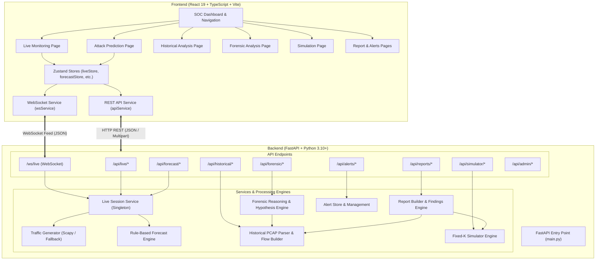

# NEXTRACE AI — Network Attack Forecasting & Forensic Intelligence

NEXTRACE AI is a prototype web application and analytical backend designed for real-time network traffic monitoring, early-stage attack forecasting, historical PCAP forensic analysis, attack scenario simulation, automated security reporting, and alert management.

---

## 1. Project Title

**NEXTRACE AI** (*MVP AI Network Forecaster*)

---

## 2. Project Overview

- **What the project does**: NEXTRACE AI aggregates network packet streams into sliding temporal windows to detect suspicious activity, forecast upcoming attack stages before breach escalation occurs, parse PCAP captures for forensic evidence, run controlled attack simulations, and compile structured security reports.
- **Problem it solves**: Traditional Network Intrusion Detection Systems (NIDS) raise reactive alerts after an attack vector has succeeded. NEXTRACE AI uses temporal window feature analysis to project next-stage attack vectors (e.g., predicting *Lateral Movement* or *Data Exfiltration* during early *Reconnaissance* or *Initial Access* phases) giving security teams proactive lead time.
- **Intended users**: Security Operations Center (SOC) Analysts, Incident Responders, Forensic Investigators, and System Administrators.
- **Main objective**: Provide a high-fidelity prototype demonstrating modular live packet streaming, deterministic attack forecasting, PCAP evidence analysis, hypothesis testing, Fixed-K simulation playback, and report generation in a unified interface.

---

## 3. Problem Statement

Modern Security Operations Centers (SOCs) face several key challenges:
1. **Reactive Detection**: Legacy security tools alert on attacks after compromised credentials or exfiltration events are already underway.
2. **Alert Fatigue**: High volumes of un-contextualized alerts overwhelm analysts, making it hard to prioritize critical multi-stage threats.
3. **Siloed Tools**: Live monitoring, PCAP packet analysis, forensic hypothesis testing, and report drafting are usually performed in disparate, disconnected systems.

---

## 4. Proposed Solution

NEXTRACE AI solves these issues through a unified, modular system architecture:
- **Live Demo Monitoring & Real-Time Forecasting**: Streams synthetic network events via WebSockets, aggregates traffic into temporal sliding windows, and applies a forecasting engine to classify current attack stages, predict upcoming stages, and calculate feature contribution weights.
- **Historical & Forensic Intelligence**: Uploads `.pcap`/`.pcapng` files, builds bidirectional network flows, calculates cryptographic SHA-256 evidence hashes, detects heuristic attack indicators, evaluates anti-forensic anomalies (e.g., capture gaps, timestamp irregularities), and tests forensic hypotheses.
- **Fixed-K Attack Simulator**: Provides an in-memory simulation engine for running step-by-step synthetic attack scenarios ($K=3..10$ steps) without deploying real network traffic.
- **Automated Report Builder**: Converts completed historical, forensic, or simulation datasets into structured reports with finding severity breakdowns and legal disclaimers.

---

## 5. Key Features

### Implemented Features
- **Live Monitoring Dashboard**: Real-time packet event log table, active entity tracker (communicating IP pairs), protocol distribution visualization, and session mode controls (`benign` vs. `suspicious`).
- **Attack Stage Forecasting**: Deterministic stage progression model (*Reconnaissance* → *Initial Access* → *Lateral Movement* → *Data Exfiltration*) complete with feature attribution analysis and confidence metrics.
- **WebSocket Feed (`/ws/live`)**: Asynchronous WebSocket streaming broadcasting packet events, temporal state aggregations, session status, and forecast updates.
- **Historical PCAP Analysis**: Background file parsing (`.pcap`, `.pcapng`, `.cap`, `.gz`), flow extraction, temporal feature windowing, SHA-256 evidence hashing, and heuristic detection for port scans, brute-force attacks, C2 backdoors, ICMP floods, DoS floods, and large transfers.
- **Forensic Reasoning Engine**: Automated analysis pipeline evaluating evidence integrity, summary statistics, anti-forensic indicators, hypothesis verification (H1–H5), and cautious final assessments.
- **Fixed-K Attack Simulator**: In-memory simulation runner supporting scenarios (`ransomware_exfil`, `apt_stealth_recon`, `insider_data_theft`, `dos_amplification`), step count ($K=3..10$), playback speed, and step-by-step progression controls (`next`, `pause`, `resume`, `reset`).
- **Automated Reporting**: Generates structured, multi-section reports with finding severity breakdowns (Historical and Simulation types) and lightweight in-memory storage.
- **Security Alerts System**: Filterable alerts table with search, severity tagging, status transitions (`new`, `acknowledged`, `resolved`), and user assignment controls.
- **Multi-Role Demo UI**: Role-switching UI (SOC Analyst vs. Admin views) and an integrated AI Investigation Assistant modal.

### Future / Planned Features
- **Trained Deep Learning Model (LSTM / GNN)**: Replacing the rule-based forecast engine with a trained neural network for sequence prediction.
- **LLM-Based Natural Language Reasoning**: Integrating actual LLM APIs for dynamic forensic hypothesis generation and report synthesis.
- **Persistent Database Storage**: Migrating from in-memory dictionary stores to PostgreSQL / MongoDB for historical job, alert, and report persistence.
- **Live Interface Adapter Capture**: Capturing packets directly from physical network interfaces (e.g., via PyPcap or raw socket bindings).
- **Production Authentication**: Implementing JWT/OAuth2 authentication and granular Role-Based Access Control (RBAC).

---

## 6. System Architecture

NEXTRACE AI follows a clean, decoupled architecture separating the frontend user interface from the backend analytical engine.

- **Frontend**: Single Page Application built with React 19, TypeScript, React Router v7, Zustand for state management, Recharts for metric visualization, Lucide React icons, and `@xyflow/react` for entity graph rendering.
- **Backend API**: FastAPI application on Uvicorn with asynchronous background task execution (`asyncio.run_in_executor`), WebSocket streaming handlers, and Pydantic schemas.
- **Traffic Generator**: Synthetic packet event generator built with Scapy (with pure-Python fallback) generating private/RFC documentation IP space traffic.
- **Forecasting Engine**: Modular base engine (`ForecastEngine`) implemented as a heuristic rule engine (`RuleBasedForecastEngine`) analyzing temporal feature metrics.
- **Historical & Forensic Pipeline**: PCAP file parser (`scapy.all.rdpcap`), flow builder, feature engineer, heuristic detector, and forensic hypothesis evaluator.
- **Simulator Module**: Isolated in-memory Fixed-K scenario state machine.
- **Reports & Alerts Modules**: In-memory data store managing generated report objects and alert lifecycle states.

### Mermaid Architecture Diagram



---

## 7. End-to-End Workflow

```
User → Frontend (React UI) → Backend REST API / WebSocket → Validation → Feature Extraction / Rule Engine → Forensic / Simulator Engine → Reports & Alerts → Frontend Display
```

### 1. Live Monitoring & Forecasting Stream
1. Analyst starts a session via `POST /api/live/start` selecting mode (`benign` or `suspicious`) and window duration.
2. `LiveSession` launches `traffic/generator.py` in an asyncio task to produce continuous synthetic packet events (20–100 pkts/s).
3. Individual packet events stream via WebSocket (`/ws/live`) to the React frontend `liveStore`.
4. Every `window_seconds`, `compute_temporal_state()` calculates connection rates, protocol ratios, unique IP/port counts, and byte volumes.
5. `RuleBasedForecastEngine.predict()` processes metrics against heuristic thresholds, updates stage progression, computes feature contributions, and broadcasts `forecast_update`.
6. Frontend updates the Attack Prediction dashboard with current stage, predicted next stage, confidence score, and feature attributions.

### 2. Historical PCAP Analysis & Forensic Investigation
1. Analyst uploads `.pcap` or `.pcapng` file via `POST /api/historical/upload` (or triggers demo via `POST /api/historical/demo`).
2. Backend validates size (<50MB) and format, computes SHA-256 hash, creates queued job `HIST-XXXX`, and saves a temporary file.
3. Thread pool executor parses packets, aggregates bidirectional network flows, and computes temporal sliding windows.
4. Heuristic detectors evaluate vertical/horizontal port scans, brute-force auth probing, exploit/C2 backdoor ports, ICMP anomalies, volumetric floods, and large transfers.
5. Analyst triggers forensic analysis via `POST /api/forensic/{job_id}/analyze`.
6. `run_forensic_analysis()` validates evidence integrity, creates evidence summaries, scans for anti-forensic indicators (e.g., timestamp jumps, capture gaps), tests hypotheses (H1–H5), and builds a final assessment.
7. Analyst requests `POST /api/reports/historical/{job_id}/generate` to build a multi-section forensic report.

---

## 8. Technology Stack

| Layer | Technology | Purpose |
|------|------------|---------|
| **Frontend Framework** | React 19 (TypeScript) | User interface component construction and reactive rendering |
| **Build Tool & Server** | Vite 8 | Development server, HMR, and production bundler |
| **Routing** | React Router v7 | Client-side page navigation and parameter routing |
| **State Management** | Zustand 5 | Global state management for live streams, forecasts, jobs, and alerts |
| **Styling** | Vanilla CSS / Tailwind CSS 4 | Modern dark-mode styling and layout system |
| **Data Visualization** | Recharts 3 | Responsive metric charts, area trends, and bar graphs |
| **Graph Visualization** | `@xyflow/react` (React Flow 12) | Interactive network entity relationship diagrams |
| **Icons** | Lucide React 1 | UI icon set for navigation and status indicators |
| **Backend Framework** | FastAPI 0.110+ | Asynchronous REST API framework and WebSocket routing |
| **ASGI Server** | Uvicorn 0.29+ | High-performance ASGI server for Python backend |
| **Packet Capture/Parsing** | Scapy 2.5+ | In-memory packet construction and PCAP binary decoding |
| **Data Processing** | Pandas 2.0+ & NumPy 1.24+ | Data structures, array operations, and feature calculations |
| **Data Validation** | Pydantic 2.0+ | Request/response schema validation and type safety |

---

## 9. Project Structure

```
MVP-AI-network-forecaster/
├── nextrace-ai/                      # Main Application Workspace
│   ├── backend/                      # Python FastAPI Backend
│   │   ├── admin/                    # Admin user management & data sources
│   │   ├── alerts/                   # Alert store, models, and status handlers
│   │   ├── api/                      # FastAPI Router definitions
│   │   │   ├── admin.py              # System status & data sources endpoints
│   │   │   ├── alerts.py             # Security alerts management endpoints
│   │   │   ├── forecast.py           # Attack forecasting REST endpoint
│   │   │   ├── forensic.py           # Forensic reasoning pipeline endpoints
│   │   │   ├── health.py             # Basic health check endpoint
│   │   │   ├── historical.py         # PCAP upload & job status endpoints
│   │   │   ├── live.py               # Live session start/stop/status endpoints
│   │   │   ├── reports.py            # Report generation & listing endpoints
│   │   │   ├── simulator.py          # Fixed-K simulation control endpoints
│   │   │   └── websocket_handler.py  # Live WebSocket broadcast handler (/ws/live)
│   │   ├── features/                 # Temporal window feature engineering logic
│   │   ├── forecasting/              # RuleBasedForecastEngine implementation
│   │   ├── forensic/                 # Evidence summary, anti-forensics, & hypothesis logic
│   │   ├── historical/               # PCAP parser, flow builder, & heuristic detectors
│   │   ├── models/                   # Pydantic schema definitions
│   │   ├── reports/                  # Findings builder & report section compilers
│   │   ├── services/                 # LiveSession background runner & state manager
│   │   ├── simulator/                # Fixed-K simulation scenarios & state machine
│   │   ├── traffic/                  # Scapy-based synthetic packet generator
│   │   ├── main.py                   # FastAPI entry point & CORS configuration
│   │   └── requirements.txt          # Python backend dependencies
│   ├── src/                          # React Frontend Application
│   │   ├── components/               # UI components (dashboard, layout, alerts, etc.)
│   │   ├── pages/                    # React page views (Live, Historical, Forensic, Sim, etc.)
│   │   ├── services/                 # API client (`api.ts`) & WebSocket manager (`websocket.ts`)
│   │   ├── store/                    # Zustand stores for state management
│   │   ├── types/                    # TypeScript interfaces & type definitions
│   │   ├── App.tsx                   # Main React routing component
│   │   ├── main.tsx                  # React DOM root entry point
│   │   └── index.css                 # Application design system & global styles
│   ├── package.json                  # Frontend dependencies & npm scripts
│   └── vite.config.ts                # Vite configuration
└── README.md                         # Root project documentation
```

---

## 10. ML / AI Analysis

### Model Implementation Status
- **Actual Implementation**: The application currently uses a **deterministic heuristic rule engine** (`RuleBasedForecastEngine` in `backend/forecasting/engine.py`), **NOT a trained machine learning model or an LLM**.
- **Model Type**: Rule-based decision threshold logic simulating stage progression across temporal windows.
- **Classification Type**: Categorical classification into discrete MITRE-aligned attack stages (`Reconnaissance`, `Initial Access`, `Lateral Movement`, `Data Exfiltration`).

### Input Features & Decision Logic
The forecast engine evaluates metrics computed over sliding temporal windows (`compute_temporal_state()`):
- `suspicious_ratio`: Ratio of suspicious packet events to total window packets.
- `connection_rate`: Packets processed per second.
- `unique_dst_ips`: Count of distinct destination IP addresses contacted.
- `unique_dst_ports`: Port diversity count.
- `icmp_count`: Probing ICMP packet count.
- `byte_count`: Total outbound volume in bytes.

### Threshold Rules & Stage Progression
- **Normal Activity / Benign**: Triggered when `mode == "benign"` or metrics remain below suspicious thresholds.
- **Reconnaissance**: `icmp_count >= 2` OR `suspicious_ratio >= 0.05`.
- **Initial Access**: `suspicious_ratio >= 0.15` OR `unique_dst_ports >= 5`.
- **Lateral Movement**: `suspicious_ratio >= 0.25` AND `unique_dst_ips >= 6`.
- **Data Exfiltration**: `suspicious_ratio >= 0.40` AND `byte_count >= 40,000`.

To avoid false stage jumping, the engine requires $N=2$ consecutive windows meeting stage criteria before advancing the current stage.

### LLM & Agent Workflow Clarification
- **LLM Usage**: There is **NO active LLM API or model inference call** integrated in the backend codebase. UI references (such as the "AI Investigation Assistant" or "AI Forensic Reasoning") produce structured template-based output with explicit cautious disclaimers.
- **Agent Workflow**: The "agents" described in UI views represent modular Python workflows (e.g., evidence builder, anti-forensics detector, hypothesis evaluator) running deterministically.

---

## 11. API Documentation

| Method | Endpoint | Purpose |
|--------|----------|---------|
| `GET` | `/` | Root product metadata & documentation links |
| `GET` | `/api/health` | Backend service health check |
| `GET` | `/api/live/status` | Current live-session running state and metrics |
| `POST` | `/api/live/start` | Start live demo session (`mode`: `benign`/`suspicious`, `window_seconds`) |
| `POST` | `/api/live/stop` | Stop running live demo session |
| `GET` | `/api/live/summary` | Aggregate session traffic summary |
| `GET` | `/api/forecast/current` | Most recent forecast result from rule-based engine |
| `WS` | `/ws/live` | WebSocket connection streaming real-time packets, states & forecasts |
| `POST` | `/api/historical/upload` | Upload `.pcap` / `.pcapng` file for background analysis |
| `POST` | `/api/historical/demo` | Initiate demo analysis on synthetic PCAP capture |
| `GET` | `/api/historical` | List all historical analysis jobs |
| `GET` | `/api/historical/{job_id}/status` | Poll processing progress for historical job |
| `GET` | `/api/historical/{job_id}/result` | Retrieve completed historical flow & heuristic result |
| `POST` | `/api/forensic/{job_id}/analyze` | Start forensic reasoning pipeline on completed job |
| `GET` | `/api/forensic/{job_id}/status` | Poll forensic reasoning analysis progress |
| `GET` | `/api/forensic/{job_id}/result` | Retrieve full forensic hypotheses & final assessment |
| `POST` | `/api/simulator/start` | Start new Fixed-K attack scenario simulation |
| `GET` | `/api/simulator/list` | List active & past simulation sessions |
| `GET` | `/api/simulator/scenarios` | Return available attack scenarios & configuration limits |
| `GET` | `/api/simulator/{id}/status` | Poll simulator state, current step & snapshots |
| `POST` | `/api/simulator/{id}/pause` | Pause running simulation |
| `POST` | `/api/simulator/{id}/resume` | Resume paused simulation |
| `POST` | `/api/simulator/{id}/stop` | Stop running simulation |
| `POST` | `/api/simulator/{id}/reset` | Reset simulation state to initial step |
| `POST` | `/api/simulator/{id}/next` | Manually advance simulation by one step |
| `GET` | `/api/simulator/{id}/result` | Retrieve complete simulation events & forecast sequence |
| `GET` | `/api/reports/list` | List summaries of all generated reports |
| `GET` | `/api/reports/historical/{job_id}/findings` | Preview findings for historical job |
| `GET` | `/api/reports/simulation/{sim_id}/findings` | Preview findings for simulation |
| `POST` | `/api/reports/historical/{job_id}/generate` | Build & store historical forensic report |
| `POST` | `/api/reports/simulation/{sim_id}/generate` | Build & store simulation report |
| `GET` | `/api/reports/{report_id}` | Retrieve full report by ID |
| `GET` | `/api/alerts` | List security alerts with filtering & pagination |
| `GET` | `/api/alerts/stats` | Alert summary metrics (by severity & status) |
| `GET` | `/api/alerts/{alert_id}` | Retrieve specific alert details |
| `PATCH` | `/api/alerts/{alert_id}` | Update alert status (`acknowledged`/`resolved`) or assignment |
| `POST` | `/api/alerts/{alert_id}/acknowledge` | Acknowledge alert |
| `POST` | `/api/alerts/{alert_id}/resolve` | Resolve alert |
| `GET` | `/api/admin/users` | List demo admin users and user role stats |
| `POST` | `/api/admin/users` | Create demo admin user |
| `PATCH` | `/api/admin/users/{user_id}` | Update user details or role |
| `GET` | `/api/admin/health` | Health summary across all backend modules |
| `GET` | `/api/admin/data-sources` | Metadata summary of supported data sources |

---

## 12. Database

### Current Storage Architecture
- **In-Memory Storage**: The system currently uses Python in-memory dictionaries and singletons rather than an external database system (such as PostgreSQL or SQLite).
- **Data Collections**:
  - `_JOBS`: Dictionary in `backend/api/historical.py` holding PCAP upload job states and results.
  - `_FORENSIC_JOBS`: Dictionary in `backend/api/forensic.py` holding forensic reasoning results.
  - `_SIMULATIONS`: Dictionary in `backend/simulator/engine.py` holding Fixed-K simulation states.
  - `_REPORTS`: Dictionary in `backend/reports/report_builder.py` holding generated report objects.
  - `_ALERTS`: In-memory list in `backend/alerts/store.py` holding security alert records.
  - `live_session`: Singleton instance in `backend/services/live_session.py` managing live traffic streaming state.

### Data Schemas
Models are defined via Pydantic (`backend/models/schemas.py`) and dataclasses:
- **`PacketEvent`**: `timestamp`, `protocol`, `src_ip`, `dst_ip`, `src_port`, `dst_port`, `packet_size`, `direction`, `classification`, `payload_info`.
- **`TemporalState`**: `window_index`, `window_start`, `window_end`, `packet_count`, `byte_count`, `flow_count`, `unique_src_ips`, `unique_dst_ips`, `unique_dst_ports`, `connection_rate`, `suspicious_ratio`.
- **`ForecastResult`**: `current_stage`, `predicted_next_stage`, `confidence`, `time_window`, `target`, `supporting_features`, `feature_contributions`, `stage_probabilities`.

---

## 13. Environment Variables

### Frontend (`.env`)
```env
# Base URL for REST API calls (Default: http://localhost:8000)
VITE_API_BASE_URL=http://localhost:8000

# Base URL for WebSocket connections (Default: ws://localhost:8000)
VITE_WS_BASE_URL=ws://localhost:8000
```

### Backend (`backend/main.py`)
```env
# Host address for Uvicorn server (Default: 127.0.0.1)
HOST=127.0.0.1

# Port for Uvicorn server (Default: 8000)
PORT=8000
```

---

## 14. Known Limitations

- **In-Memory State Volatility**: All session data, historical jobs, simulation states, alerts, and generated reports reside in server memory and will reset if the FastAPI backend process restarts.
- **Rule-Based Forecasting**: Attack stage forecasting relies on heuristic decision rules rather than a trained ML model.
- **Synthetic Traffic Generation**: Live traffic monitoring relies on synthetically generated Scapy packet events rather than binding to host NIC adapters.
- **Demo Security Boundary**: Admin controls and role switching are prototype UI features without cryptographically enforced password hashing or JWT session management.
- **PCAP File Size Limit**: PCAP file uploads are capped at 50 MB in the current demo configuration.

---

## 15. Future Improvements

- **Trained Sequence Model**: Implement a supervised LSTM / GRU network trained on benchmark datasets (e.g., CICIDS2017) to replace the rule-based engine.
- **Persistent Database**: Add PostgreSQL with SQLAlchemy for persistent storage of jobs, reports, and alerts.
- **Live Interface Capture**: Add raw socket / PyPcap network adapter capturing for live deployment.
- **LLM Integration**: Connect a local or cloud LLM framework for dynamic forensic hypothesis generation and report synthesis.
- **Production Authentication**: Implement OAuth2 / JWT authentication and Role-Based Access Control (RBAC).

---

## 16. Getting Started / Running Locally

### Prerequisites
- **Node.js** (v18+) & **npm**
- **Python** (3.10+) & **pip**

### 1. Start Backend Server
```bash
cd nextrace-ai/backend
pip install -r requirements.txt
python main.py
```
*The FastAPI backend will start at `http://127.0.0.1:8000` (API docs at `http://127.0.0.1:8000/api/docs`).*

### 2. Start Frontend App
```bash
cd nextrace-ai
npm install
npm run dev
```
*The React application will launch at `http://localhost:5173`.*
