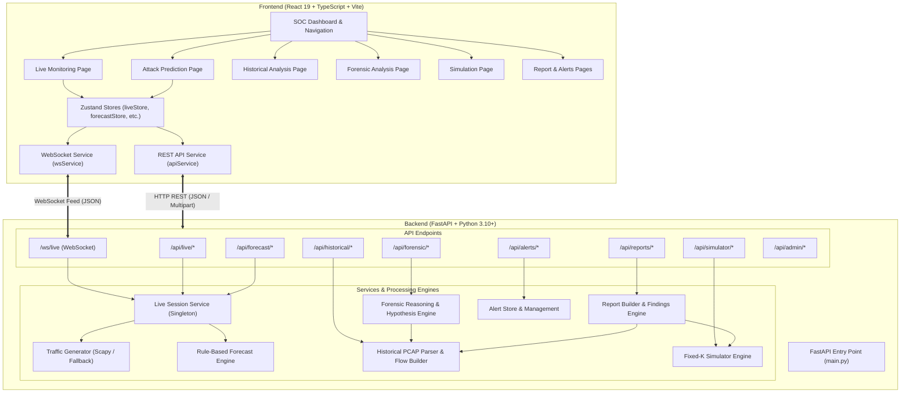

<div align="center">

<!-- BANNER -->


<!-- BADGES -->
<p align="center">
  
  
  
  
  
  
</p>

<!-- LINKS -->
<p align="center">
  <a href="#">
    
  </a>
</p>

</div>

---

> **SIH 2026 · Problem Statement SIH26153**  
> **Theme:** Blockchain & Cybersecurity  
> **Organization:** National Technical Research Organisation (NTRO)  
> *"Design and develop a software prototype that learns the evolving state of a computer network from traffic telemetry and predicts the likelihood and progression of malicious activity **before compromise is completed**... The core deliverable is a learned model of network state transition dynamics — **not a static classifier**."*

## Overview

**NEXTRACE AI** (*MVP AI Network Forecaster*) is a prototype web application and analytical backend designed for real-time network traffic monitoring, early-stage attack forecasting, historical PCAP forensic analysis, attack scenario simulation, automated security reporting, and alert management.

**Traditional IDS:** “Is this individual flow malicious?”  
**NEXTRACE AI:** “Given the current network state, what is the probability $P(S_{t+1} \mid S_t)$ of transitioning into an attack stage in the next temporal window?”

NEXTRACE AI aggregates network packet streams into sliding temporal windows to detect suspicious activity, forecast upcoming attack stages before breach escalation occurs (e.g., predicting *Lateral Movement* or *Data Exfiltration* during early *Reconnaissance*), giving SOC Analysts, Incident Responders, and System Administrators proactive lead time.

---

## Core Idea & Architecture

Instead of evaluating packets in isolation, NEXTRACE AI models the network as a dynamic system. 

```text
Flow / PCAP Capture
        ↓
Feature Extraction (suspicious_ratio, connection_rate, distinct IPs/ports)
        ↓
Temporal Network-State Windows (Sₜ)
        ↓
State Transition / Forecasting Engine
        ├── Predicts Next Stage: P(S_{t+1} | S_t)
        ├── Attributes Feature Weights
        └── Maps to MITRE ATT&CK
        ↓
Security Operations Center (SOC) Dashboard
```

NEXTRACE AI solves these industry challenges through a unified architecture:
- **Live Demo Monitoring & Real-Time Forecasting**: Streams synthetic network events via WebSockets, aggregates traffic into temporal sliding windows, and forecasts current and upcoming attack stages.
- **Historical & Forensic Intelligence**: Uploads `.pcap`/`.pcapng` files, builds bidirectional network flows, and tests forensic hypotheses (evaluating anti-forensic anomalies like capture gaps or timestamp irregularities).
- **Fixed-K Attack Simulator**: Provides an in-memory simulation engine for running step-by-step synthetic attack scenarios ($K=3..10$ steps).
- **Automated Report Builder**: Converts completed analysis into structured security reports with severity breakdowns and legal disclaimers.

---

## Key Features

### Implemented Features
- **Live Monitoring Dashboard**: Real-time packet event log table, active entity tracker, protocol distribution visualization, and session mode controls (`benign` vs. `suspicious`).
- **Attack Stage Forecasting**: Deterministic stage progression model (*Reconnaissance* → *Initial Access* → *Lateral Movement* → *Data Exfiltration*) with feature attribution.
- **WebSocket Feed (`/ws/live`)**: Asynchronous WebSocket streaming broadcasting packet events and forecast updates.
- **Historical PCAP Analysis**: Background file parsing, flow extraction, SHA-256 evidence hashing, and heuristic detection for port scans, brute-force attacks, C2 backdoors, ICMP floods.
- **Forensic Reasoning Engine**: Automated analysis pipeline evaluating evidence integrity and anti-forensic indicators.
- **Fixed-K Attack Simulator**: In-memory simulation runner supporting scenarios like `ransomware_exfil`, `apt_stealth_recon`, etc.
- **Automated Reporting & Alerts**: Generates multi-section reports and maintains a filterable security alerts system.

### Future / Planned Features (Roadmap)
- **Trained Deep Learning Sequence Model (LSTM / GNN)**: Upgrading the rule-based MVP engine to a supervised neural network trained on the **CSE-CIC-IDS2018** dataset to predict multi-horizon forecasts (e.g., 30, 60, 90 seconds).
- **LLM-Based Natural Language Reasoning**: Integrating LLM APIs for dynamic forensic hypothesis generation and report synthesis.
- **Persistent Database Storage**: Migrating from in-memory stores to PostgreSQL.
- **Live Interface Adapter Capture**: Capturing packets directly from physical network interfaces via PyPcap.

---

## End-to-End Workflow

```text
User → Frontend (React) → Backend REST/WS → Feature Extraction → Rule Engine → Forensic/Simulator Engine → Reports & Alerts → Frontend
```

1. **Live Forecasting**: The analyst starts a session. Synthetic packet events stream via WebSocket (`/ws/live`). Every `window_seconds`, the backend computes temporal states (connection rates, protocol ratios, unique IP/port counts) and evaluates metrics to broadcast `forecast_update`.
2. **Historical Investigation**: The analyst uploads a `.pcap` file. The backend computes SHA-256 hashes, parses packets, aggregates bidirectional flows, and runs heuristic detectors. The analyst triggers forensic analysis to test hypotheses (H1–H5) and generates a structured report.

---

## Technology Stack

| Layer | Technology | Purpose |
|------|------------|---------|
| **Frontend Framework** | React 19 (TypeScript) | User interface component construction |
| **State & Routing** | Zustand 5 & React Router v7 | Global state management and client-side routing |
| **Visualization** | Recharts 3 & `@xyflow/react` | Metric charts and interactive network entity graphs |
| **Backend Framework** | FastAPI & Uvicorn | Asynchronous REST API and WebSocket server |
| **Packet Capture** | Scapy 2.5+ | In-memory packet construction and PCAP binary decoding |
| **Data Processing** | Pandas & NumPy | Data structures, array operations, and feature calculations |

---

## System Architecture

### Mermaid Diagram



---

## ML / AI Analysis & Data Storage

- **Implementation**: The application currently leverages a **deterministic heuristic rule engine** to classify categorical attack stages (Reconnaissance → Initial Access → Lateral Movement → Data Exfiltration).
- **In-Memory Storage**: Current state (jobs, alerts, simulations, reports) is maintained in-memory for the MVP prototype. Persistent storage (PostgreSQL) is planned.
- **Data Schemas (Pydantic)**: Defines `PacketEvent`, `TemporalState` (sliding windows), and `ForecastResult` (current/next stage, confidence, and feature contributions).

---

## Getting Started / Running Locally

### Prerequisites
- **Node.js** (v18+) & **npm**
- **Python** (3.10+) & **pip**

### 1. Start Backend Server
```bash
cd nextrace-ai/backend
pip install -r requirements.txt
python main.py
```
*The FastAPI backend will start at `http://127.0.0.1:8000` (API docs at `http://127.0.0.1:8000/docs`).*

### 2. Start Frontend App
```bash
cd nextrace-ai
npm install
npm run dev
```
*The React application will launch at `http://localhost:5173`.*
